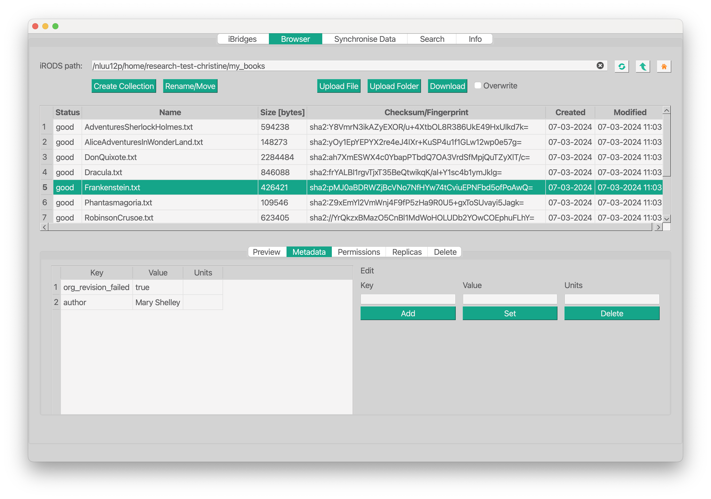

# iBridges GUI   


<p align="center">
  <p align="center">
    <a href="https://ibridges-for-irods.github.io/iBridges-GUI/"><strong> Documentation »</strong></a> .
    <a href="https://github.com/iBridges-for-iRods/iBridges-GUI/issues">Report Bug or Request Feature</a>
    .
  </p>
</p>

[](https://github.com/iBridges-for-iRods/iBridges-GUI/actions/workflows/linter.yml)
[](https://github.com/iBridges-for-iRods/iBridges-GUI/actions/workflows/publish.yml)
[](https://doi.org/10.5281/zenodo.12583957)


## About

The git repository contains a generic *iRODS* graphical user interface.  The iRODS functionality is based on [ibridges](https://github.com/UtrechtUniversity/iBridges) and works with any *iRODS* instance.  


  
## Highlights

- Works on Windows, Mac OS and Linux: [supported versions](https://doc.qt.io/qt-6/supported-platforms.html)

- Runs on Python 3.9 or higher.
- Supported iRODS server versions: 4.2.11 or higher and 4.3.0 or higher.
- **Upload** and **Download** your data.
- Manipulate the **metadata** on the iRODS server.
- **Synchronize** your data between your local computer and the iRODS server.
- **Search** through all metadata for your dataset or collection.
- Safe default options when working with your data.

## Prebuild executable <alpha>
There are prebuild executables available for Windows, macos and Ubuntu.
You can find the latest release [here](https://github.com/iBridges-for-iRODS/iBridges-GUI/releases/latest).
The build was done using the latest version on an x64 architecture.


## Installation
- The python package 

  ```bash
  pip install ibridgesgui
  ```
  
- A specific branch of the git repository (testers, developers)

  ```bash
  pip install git+https://github.com/iBridges-for-iRODS/iBridges-GUI.git@branch-name
  ```
  
- Locally from code (for developers)

  ```bash
  git clone git@github.com:iBridges-for-iRODS/iBridges-Gui.git
  cd iBridges-Gui
  pip install ".[all]"
  ```
  
## Start the GUI
- From a pip python package

  ```bash
  ibridges-gui
  ```
- From code (for developers)

  ```bash
  python ibridgesgui/__main__.py
  ```

 ## Building Executables

We offer build scripts in case you would like to compile iBridges and distribute the executable.

```
python3 build_tools/build_script.py -h

usage: build_script.py [-h] [--debug_exe] [--rem_venv]
                       [--code_folder CODE_FOLDER] [--ui_folder UI_FOLDER]
                       [--icons_folder ICONS_FOLDER] [--venv VENV]

iBridges-Gui exe creator.

options:
  -h, --help            show this help message and exit
  --debug_exe           Build executable with debug console
  --rem_venv            remove virtual environment
  --code_folder CODE_FOLDER
                        Full path to the directory with code
  --ui_folder UI_FOLDER
                        Full path to the directory with ui files
  --icons_folder ICONS_FOLDER
                        Full path to the directory with the icons
  --venv VENV           Full path to virtual python environment
```

This will create a virtual environment `venv` in your iBridges folder. Next to that you will find a new folder `build` and `ibridgesgui_dist`. The executable can be found and started like this for Mac and Linux:

```
./output/ibridgesgui/ibridges_gui.bin
```

For Windows simply click on the file `output/ibridgesgui/ibridges_gui.exe`.

Please note, that this feature is still in experimental state.
 

## Authors
**Christine Staiger (Maintainer) [ORCID](https://orcid.org/0000-0002-6754-7647)**

- *Wageningen University & Research* 2021 - 2022
- *Utrecht University* 2022

**Tim van Daalen**, *Wageningen University & Research* 2021

**Maarten Schermer (Maintainer) [ORCID](https://orcid.org/my-orcid?orcid=0000-0001-6770-3155)**, *Utrecht University* 2023

**Raoul Schram (Maintainer) [ORCID](https://orcid.org/my-orcid?orcid=0000-0001-6616-230X)**. 
*Utrecht University* 2023

## Contributors

**J.P. Mc Farland**,
*University of Groningen, Center for Information Technology*, 2022
    
## Contributing
### Code
Instructions on how to extend the GUI or contribute to the code base can be found in the [documentation](https://ibridges-for-irods.github.io/iBridges-GUI/).

## License
This project is licensed under the GPL-v3 license.
The full license can be found in [LICENSE](LICENSE).
