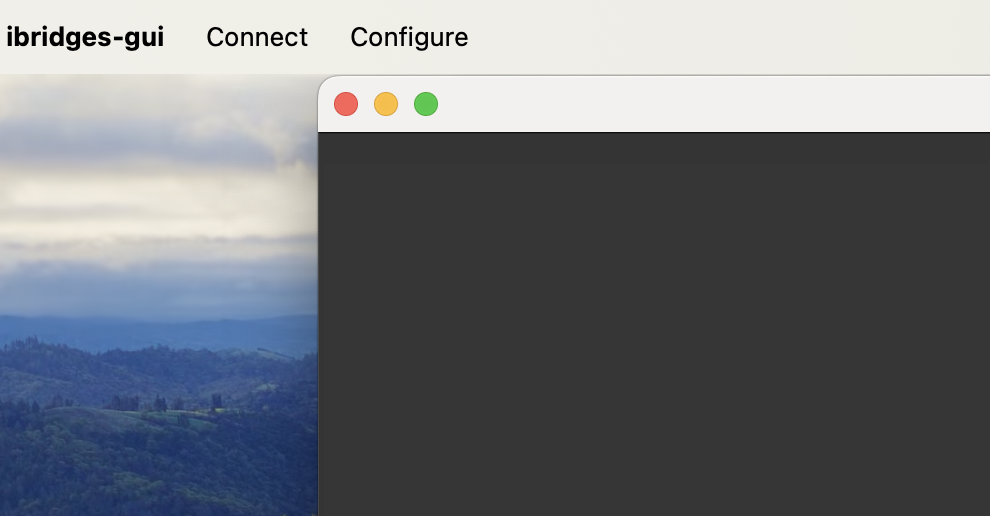
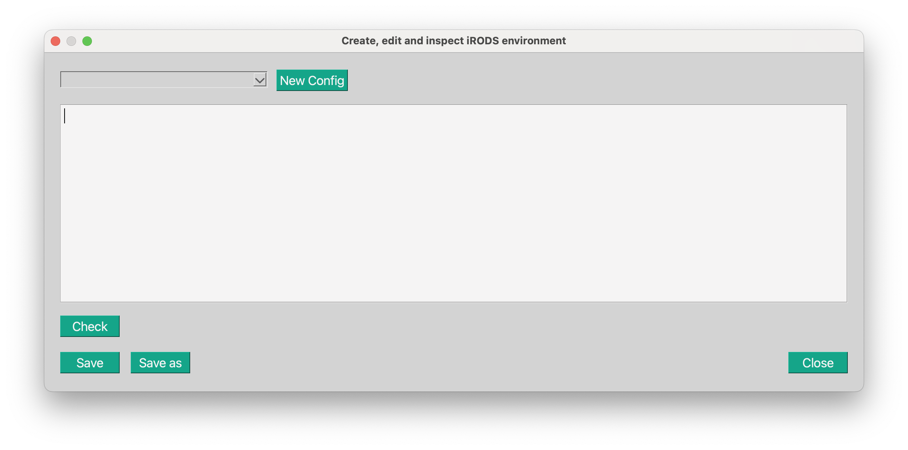
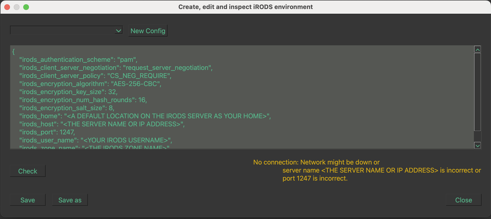
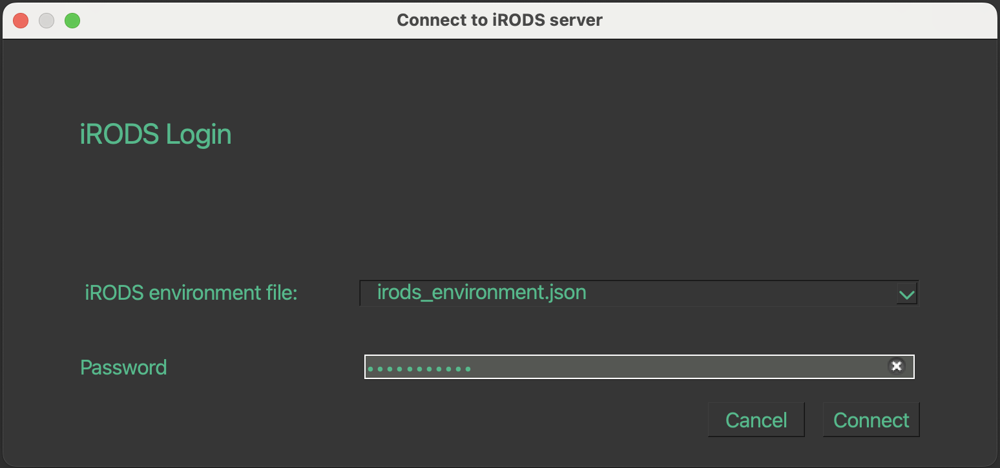

<div style="
  background-color:#e6f7f3;
  border-radius:16px;
  padding:1.8rem 2rem;
  margin-bottom:2rem;
  border-left:8px solid #4bb89e;
">

<span style="
  background:#4bb89e;
  color:white;
  padding:6px 12px;
  border-radius:6px;
  font-size:0.9rem;
  font-weight:600;
">
Start here
</span>

# Welcome to iBridges‑GUI

If you're new to iRODS or iBridges‑GUI, begin with the training materials.  
They provide guided exercises for browsing, metadata, synchronisation, and search — ideal before working with real data.

**Training resources:**

- **[iBridges Training repository](https://github.com/iBridges-for-iRODS/iBridges-Training)**  
- **[iBridges Training website](https://ibridges-for-irods.github.io/iBridges-Training/)**

These short lessons help you get comfortable quickly and build confidence using the GUI.

</div>


## Install iBridges‑GUI

Install the GUI package:

```bash
pip install ibridgesgui
```

## Start the application

Launch iBridges‑GUI from your terminal:

```bash
ibridges gui
```

## Configure your iRODS connection

To connect to an iRODS server, you need an `irods_environment.json` file.  
iBridges‑GUI can help you **create**, **edit**, or **validate** this configuration.

You can either:

- generate a configuration using server templates (via plugins),  
- create a new configuration manually, or  
- load and adjust an existing one.

### Using server templates

If your institution provides templates, install the corresponding plugin.  
Setup instructions are available in the  
**[iBridges CLI documentation](https://ibridges.readthedocs.io/en/latest/cli.html)**.

### Creating or editing a configuration

After starting iBridges‑GUI, open:

**`Connect → Configure`**

{width=50% fig-align="center"}

Choose **`Add Configuration`** to create or inspect a configuration file.

{width=75% fig-align="center"}

### Existing configurations

Previously created environment files appear in the dropdown menu.  
They follow the naming pattern:

```
irods_environment*.json
```

Select one to review or update it.

### Creating a configuration from a template

If you installed a template plugin, select the template from the dropdown, enter your username, and save the file as:

```
irods_environment.json
```

### Creating a new configuration manually

Select **`New Config`** to start from scratch.

{width=75% fig-align="center"}

You will see that some parameters are already filled in. Check them and adjust.

Click **`Check`** to test the connection.  
If errors appear, adjust the fields accordingly.  
If you are unsure about the correct values, contact your iRODS service provider.

Once the check succeeds, save the configuration using **`Save`** or **`Save As`**.  
iBridges‑GUI stores it in the correct location so it can be used for login.

# Start an iRODS session

To connect:

**`Connect → Connect to iRODS`**

This opens the login window:

{width=75% fig-align="center"}

Select your configuration file, enter your password, and press **Connect**.  
If your password is already cached by another iRODS client, it will appear as `******`.

# Executables

Since version **1.4.0**, iBridges‑GUI also supports standalone executables.  
This feature is experimental.

## Prebuilt executables

Download the appropriate ZIP file from the  
**[Releases page](https://github.com/iBridges-for-iRODS/iBridges-GUI/releases)**.

Inside the extracted folder you will find:

- `ibridges_gui.exe` (Windows)  
- `ibridges_gui.sh` (macOS/Linux)

Run the executable directly:

```bash
bash ./ibridges_gui.sh
```

or double‑click the `.exe` on Windows.

## Building executables yourself

Build scripts are included for users who want to compile and distribute the GUI.

Show the available options:

```bash
python3 build_tools/build_script.py -h
```

This creates:

- a virtual environment `venv`,  
- a `build` directory, and  
- an `ibridgesgui_dist` folder containing the executable.

Run the built executable:

```bash
./output/ibridgesgui/ibridges_gui.bin   # macOS/Linux
```

or

```bash
output/ibridgesgui/ibridges_gui.exe     # Windows
```