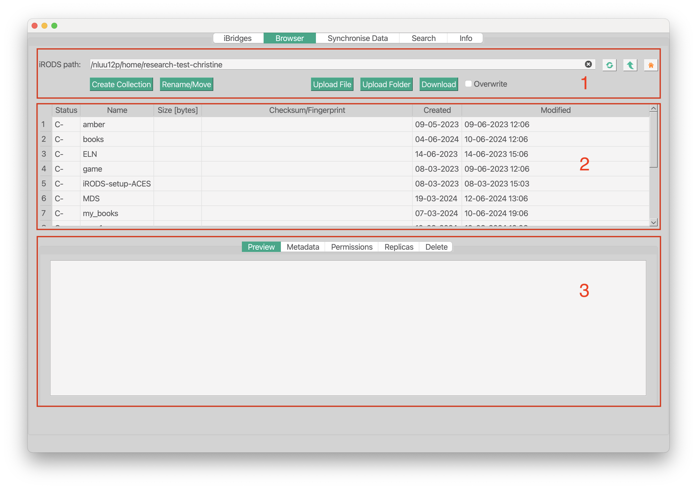
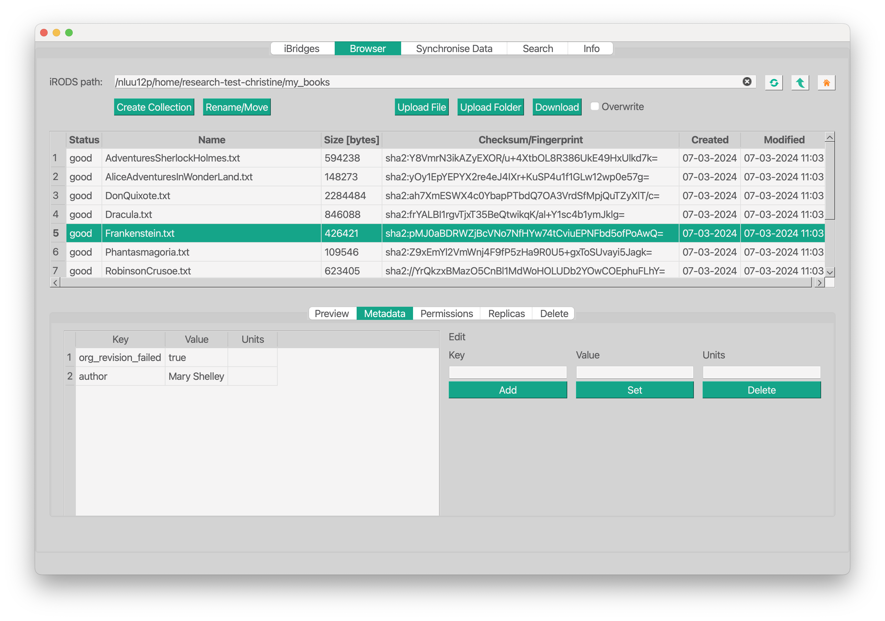
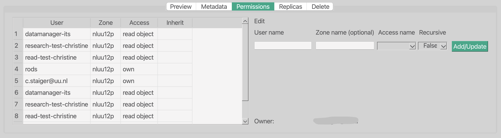
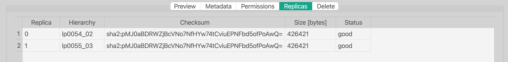
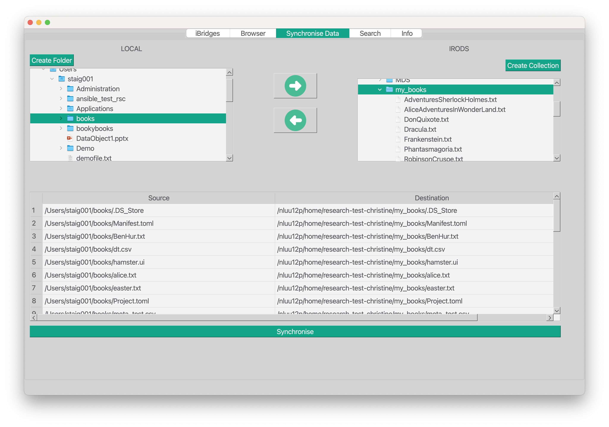
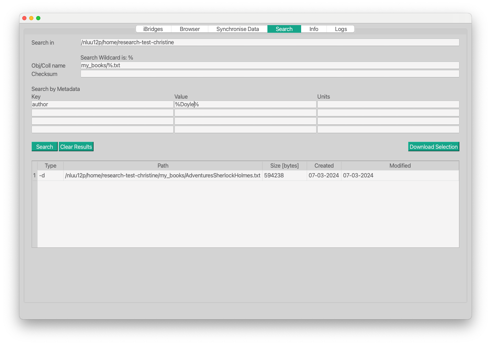

# iBridges User Documentation

## Synopsis

iBridges is a **GUI for any data‑management platform based on iRODS**. It exposes iRODS functionality through a graphical interface. The GUI groups related functionality into separate views, each representing a specific function area.

Default iBridges‑GUI views:

- **Browser** — browse iRODS collections, inspect data objects and collections, **edit metadata and permissions**, and **delete data**.
- **Data Synchronisation** — synchronise local directories with their corresponding iRODS collections.
- **Search** — search for data collections and objects.
- **Info** — summarises information such as the user’s role, groups, and the storage resources on the iRODS server, including their status and available capacity.

## Views and Plugins

In the main menu (next to the configuration menu), you will find a drop‑down menu called **“Views and Plugins”**. Selecting or deselecting items in this menu will show or hide the corresponding tabs in the GUI. All checked tabs and plugins will automatically be restored in the next session.

On first launch, the default views `Welcome`, `Browser`, `Synchronise Data`, `Search`, `Info`, and `Logs` are shown.

## Browsing through your iRODS collections

After logging into iRODS, the first view you see is the **Browser**. This view has three sections:

1. Navigation  
2. Listing  
3. Detailed inspection of data objects and collections

  

### Navigation

- The navigation bar contains an **editable field** showing your current iRODS path. On startup, it points to your `irods_home` from the configuration file.  
  You can **navigate anywhere in the iRODS tree** by editing this field and pressing `<Enter>`.

- The **three buttons** next to the path field are:
  - `Refresh` (circular arrows) — reload the listing  
  - `Up` (arrow) — go one level up  
  - `Home` (house icon) — jump to your home collection

- `Create Collection` creates a new collection at the path shown above.

- `Upload` opens a dialog to select files for upload. The destination is the path in the navigation field. You may also specify metadata files to be extracted upon upload and be stored as iRODS metadata.

- `Download` opens a dialog to choose a local destination. You may also export metadata alongside the download.  
  To download, select an item in the table below.  
  For downloading multiple items, see the **Search** section.

- `Delete` removes the selected collection or data object.  
  **Note: deleted data is permanently removed from the iRODS instance.**

### Listing

The table below the navigation bar lists all collections and data objects in the current path.

Columns:

- **Status** — `-C` for collections, or the replica status for data objects.  
  If a data object’s status is not `good`, the data is compromised. Contact your iRODS administrator. Do not use such data.
- **Name** — collection or data object name
- **Size** — size in bytes
- **Checksum** — a hash used to verify data integrity
- **Created / Modified** — timestamps for creation and last modification

- *Single click* loads details in the section below.  
- *Double click* on a collection navigates into it.

### Inspect collections and data objects

This section shows detailed information about the selected item.

- **Preview** — lists the contents of a collection or shows the first lines of text, JSON, or CSV files.

- **Metadata** — displays iRODS metadata (key, value, units).
  - *Single click* loads the metadata entry into the editable fields.
  - To create metadata, fill in *key*, *value*, and *units*, then click `Add`.  
    Multiple entries with the same key but different values are allowed.
  - `Update` updates the current selected metadata entry.
  - `Delete` removes the metadata entry matching the fields.

- **Permissions** — shows access rights for the selected item.  
  The drop‑down menu `Access name` exposes the following rights:

  | Rights/Action | upload file | write file | delete file | add metadata | update metadata | remove metadata |
  |---------------|-------------|------------|-------------|--------------|------------------|------------------|
  | delete_object | ✅ also `imkdir` | ✅ | ✅/❌ | ✅ | ❌ | ✅ |
  | modify_object | ✅ also `imkdir` | ✅ | ✅/❌ | ✅ | ✅ | ✅ |
  | create_object | ❌ | ❌ | ❌ | ✅ | ✅ | ✅ |
  | read_object   | ❌ | ❌ | ❌ | ❌ | ❌ | ❌ |
  
  

  The **Creator** label shows who created the selected item.

  Collections support `inherit` / `noinherit`.  
  `inherit` applies the collection’s permissions to newly added items.

  To apply permission changes recursively to all existing members of a collection, enable `Recursive`.

- **Replicas** — shows the storage resources where a data object is stored.  
  Collections have no replicas.

  

  Replica information is mainly for sysadmins. If a replica status is not `good`, send them this information.

## Data Synchronisation

`Synchronise Data` provides tools to **synchronise a local folder with an iRODS collection**.  
Synchronisation works both ways:

- Local → iRODS (right‑pointing arrow)
- iRODS → Local (left‑pointing arrow)

Before synchronisation, differences are calculated and shown in the text field below.  
**Note:** calculating differences may take some time.

Synchronisation works only for collections/directories, not for single files.

## Search

`Search` provides a form where you can enter path and metadata criteria.  
Click `Search` to list matching collections and data objects.

### Search fields

- The path at the top defines where the search is performed.  
  It must exist; by default, your home collection is used.

- `Obj/Coll name` filters by name.  
  Example: entering `demo` finds all items named *demo*.

- Example above: searching for all `*.txt` objects in `my_books` using `my_books/%.txt`.

- Metadata filters narrow results further.  
  Example: key `author`, value containing `Doyle` → `%Doyle%`.

  **Note: the wildcard is `%`.**

### Search results

- *Single click* or *Select all* → click `Download` to choose a destination and start downloading.
- *Double click* → open the item in the `Browser` for further inspection.