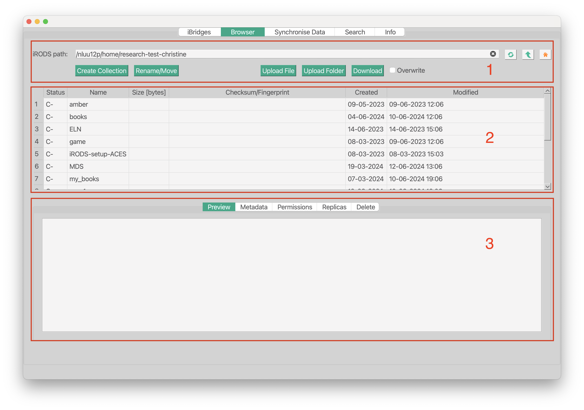
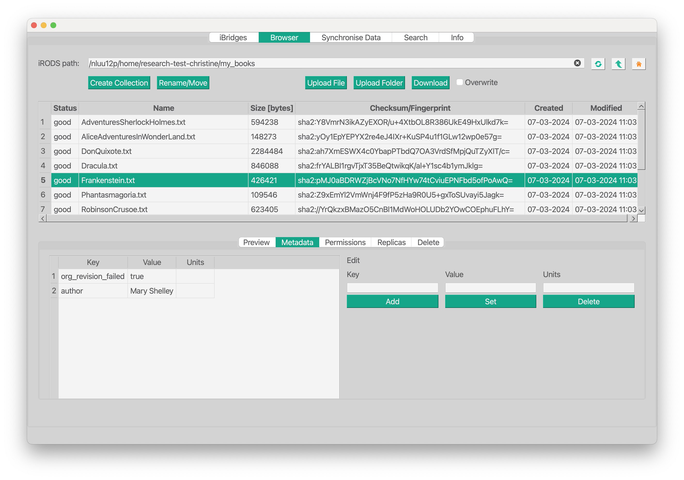
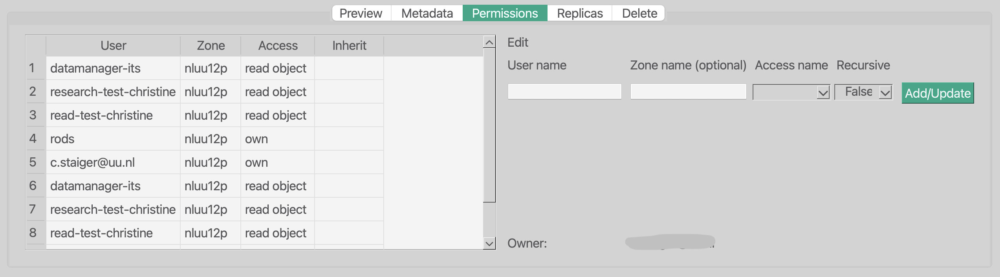
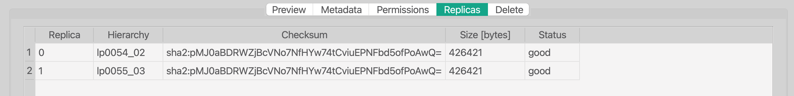
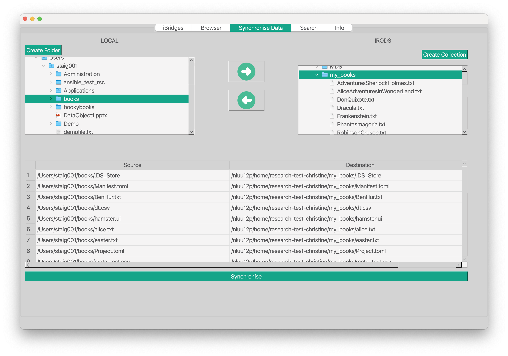
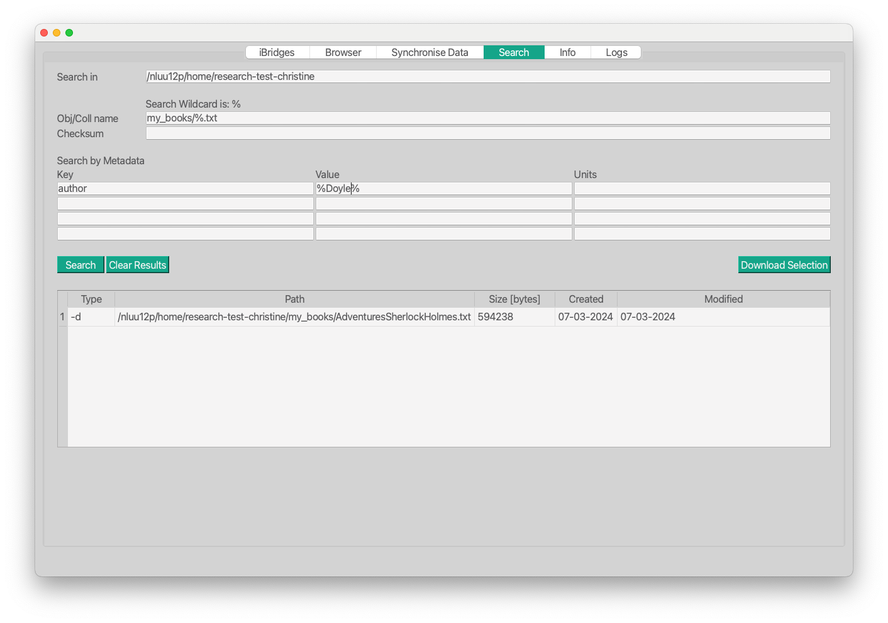
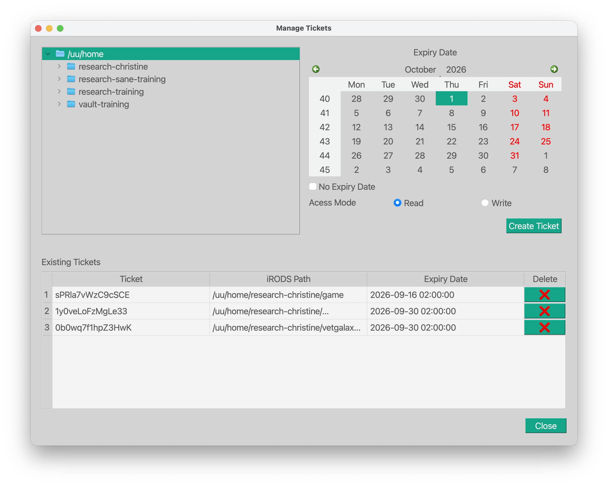
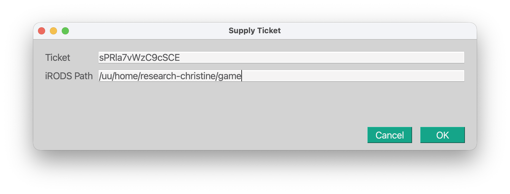

## Synopsis

iBridges‑GUI is a **graphical interface for any iRODS‑based data management platform**.  
It exposes core iRODS functionality through a set of focused views, each designed for a specific task.

Default views:

- **Browser** — explore collections, inspect data objects, edit metadata and permissions, upload/download, delete.
- **Data Synchronisation** — synchronise local directories with iRODS collections.
- **Search** — locate collections and data objects using name or metadata filters.
- **Info** — display user information, groups, and server resources (status, capacity).

## Views and Plugins

The **Views and Plugins** menu (next to *Configure*) lets you show or hide tabs.  
Checked views are restored automatically when you restart the application.

On first launch, the following tabs appear:  
`Welcome`, `Browser`, `Synchronise Data`, `Search`, `Info`, and `Logs`.

## Browser

After logging in, the **Browser** is the first view you see.  
It consists of three parts:

1. Navigation  
2. Listing  
3. Detailed inspection



### Navigation

- The path field shows your current iRODS location.  
  Edit it and press `<Enter>` to jump anywhere in the tree.

- Buttons:
  - **Refresh** — reload the listing  
  - **Up** — go one level up  
  - **Home** — jump to your home collection

- **Create Collection** — create a new collection at the current path.

- **Upload** — select files to upload.  
  Optional: include metadata files to extract and store as iRODS metadata.

- **Download** — choose a local destination.  
  Optional: export metadata alongside the download.  
  Select an item in the table to download it.  
  For downloading multiple items, use the **Search** view.

- **Delete** — permanently remove the selected item from iRODS.

### Listing

The table lists all collections and data objects at the current path.

Columns:

- **Status** — `-C` for collections; replica status for data objects.  
  If a data object’s status is not `good`, the data is compromised. Contact your iRODS administrator.
- **Name**  
- **Size**  
- **Checksum**  
- **Created / Modified**

Actions:

- *Single click* — load details below.  
- *Double click* — open a collection.

## Inspect collections and data objects

This section shows detailed information about the selected item.

### Preview

Displays collection contents or the first lines of text/JSON/CSV files.

### Metadata

Shows metadata as key–value–unit triples.

- *Single click* loads an entry into the editable fields.
- **Add** — create a new entry.  
- **Update** — modify the selected entry.  
- **Delete** — remove the entry matching the fields.



### Permissions

Shows access rights for the selected item.



- The **Access name** dropdown lists available rights.  
- **Creator** shows who created the item.
- Collections support `inherit` / `noinherit`.  
  `inherit` applies collection permissions to newly added items.
- Enable **Recursive** to apply changes to all existing members.

### Replicas

Shows the storage resources where a data object is stored.  
Collections do not have replicas.



If a replica status is not `good`, contact your iRODS administrator.

## Data Synchronisation

`Synchronise Data` lets you synchronise a local directory with an iRODS collection.

- **Local → iRODS** (right arrow)  
- **iRODS → Local** (left arrow)

Before synchronising, differences are calculated and shown in the text field.  
This may take some time for large directories.



Synchronisation works only for directories/collections, not individual files.


## Search

The **Search** view allows you to filter by path, name, and metadata.



### Search fields

- **Path** — defines where the search is performed.  
  Must exist; defaults to your home collection.

- **Obj/Coll name** — filter by name.  
  Example: `demo` finds all items named *demo*.

- Wildcards use `%`.  
  Example: `my_books/%.txt` finds all `.txt` files in `my_books`.

- **Metadata filters** — narrow results further.  
  Example: key `author`, value `%Doyle%`.

### Search results

- *Single click* or *Select all* → click **Download** to choose a destination.  
- *Double click* → open the item in the **Browser** for inspection.

## Data Sharing with iRODS tickets

### What are iRODS tickets

An iRODS ticket is a short string, for example `kpIwGA1UZN0LFnM`, that gives
access to **one collection or data object** without changing any permissions
and without the need for an account. Anyone who has the ticket string and the
path it belongs to can read the shared data.

- A ticket is either a **read** ticket or a **write** ticket.
  A write ticket also allows uploads and changes.
- A ticket can have an **expiry date**. After that date it no longer
  gives access to the data.
- Tickets are stored on the iRODS server and belong to the user who created
  them. The owner can delete a ticket at any time, which revokes the access.

Typical uses are sharing a dataset with external collaborators, publishing data
for download through an **anonymous** account, and giving temporary access.

Always share the ticket string **together with the iRODS path** it was made for.

### Create tickets



Open the ticket manager from the menu bar `Data Access`. The view has two parts: the iRODS tree
and next to it the ticket settings to choose from, and below the table with your existing tickets.

To create a ticket:

1. Select the collection or data object you want to share in the **iRODS tree**.
   The tree opens at your home collection.
2. Choose the access mode, **read** or **write**.
3. Choose when the ticket expires. Pick a date in the calendar, or check the
   box to create a ticket that does not expire. The calendar is disabled while
   the box is checked.
4. Click **Create ticket**. The new ticket appears in the table.
5. Send the ticket string and the path to the person you want to share with.

The table lists all your tickets:

- **Ticket** — the ticket string to share.
- **iRODS path** — the shared collection or data object. Hover over the path
  to see it in full.
- **Expires** — the expiry date, or `never`.
- **❌** — delete the ticket and revoke the access.

Good to know:

- A ticket stops working at the **start** of the selected day. If it should
  still work during the whole day, select the following day.
- Share write tickets with care, since they allow changes to the shared
  collection.
- Delete tickets that are no longer needed. Do not rely on the expiry date alone.

### Use tickets

You can use tickets as user of the system or as anonymous user.



#### Supply a ticket

To use a ticket, open the **Supply Ticket** dialog and fill in:

- **Ticket** — the ticket string you received.
- **iRODS path** — the path of the collection or data object the ticket was
  made for.

Click **OK**. If the ticket and the path match, the dialog closes and the
shared location becomes your current location in the **Browser**. You can then
browse, view metadata and download data. With a write ticket you can also
upload.

If something is wrong, the dialog tells you:

- *Please provide an irods path.* / *Please provide a ticket.* — one of the
  fields is empty.
- *Ticket … and path … do not match, or path does not exist.* — check the
  ticket string and the path with the person who shared the data.

#### As a user of the system

If you already have an account, log in as usual and supply the ticket. The
ticket gives you access to the shared data on top of your own permissions.

#### As an anonymous user

Collaborators without an account use the `anonymous` user of the iRODS server.
Create an iRODS environment file for it with the environment editor
(**Configure**). The user name is `anonymous` and works without providing a password.

```json
{
    "irods_host": "irods.server.url",
    "irods_port": 1247,
    "irods_user_name": "anonymous",
    "irods_zone_name": "demoZone"
}
```

If your server requires encrypted connections, add the same SSL and
encryption settings (keys starting with `irods_ssl_`, `irods_encryption_` and
`irods_client_server_`) that your regular environment file contains.

Then log in with this environment and supply the ticket as described above.
Without a ticket, an anonymous user cannot see any data.

#### Things to keep in mind

- **A ticket lasts as long as your session.** If you log out or restart the
  application, supply the ticket again.
- **Use one ticket per session.** To switch to another ticket, log in again
  first.
- **A ticket on a data object** only gives access to that object, not to the
  other items in its collection. The Browser opens the parent collection, where
  the listing may be empty. Type the full path of the object in the path field
  of the Browser to reach it.
- **Expired tickets** are still accepted by the dialog, and the shared path may
  still be visible, but downloading data fails with `CAT_TICKET_EXPIRED`. Ask
  the owner for a new ticket.
- **Deleted tickets:** if the owner deletes the ticket while you are using it,
  further actions fail with `CAT_TICKET_INVALID`. Log in again.

The same functionality is available from the command line and in Python. See the
*Working with Tickets* tutorial in the [iBridges documentation](https://ibridges.readthedocs.io/en/latest/).
