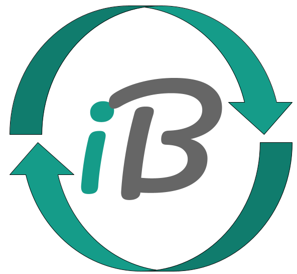

<!-- Hero header -->

  

  <h1 style="
    font-size:2.8rem;
    font-weight:700;
    margin:0;
    color:#0f7f68;
  ">
    iBridges‑GUI Documentation
  </h1>

  

    Bridging Science and Research Data Management
  

iBridges‑GUI is a lightweight, intuitive interface for working with iRODS servers.  
It turns data‑management tasks into a simple, visual workflow, making browsing, metadata editing, syncing, and permissions management straightforward for both new and experienced users.

This site provides both user and developer documentation.  
Use the links below to explore.

## Table of contents

- [What is iBridges‑Gui](docs/info.qmd)
- [Getting started](docs/getting-started.qmd)
- [User guide](docs/userdoc.qmd)
- [Contributing](docs/developers.qmd)
- [FAQ](docs/faq.qmd)
